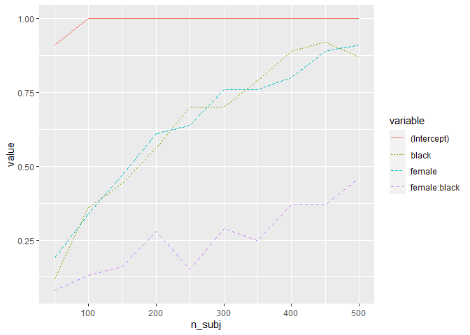

rental\_power\_analysis
================

``` r
make_cities <- function(city_n) {

  cities <- data.table(
    city = c('san francisco', 'boston', 'chicago'),
    # median_price = c(1000, 862, 700),
    # sd_city = c(200, 150, 150),
    female_subj_ratio = c(.5, .5, .5),
    black_subj_ratio = c(.5, .5, .5),
    
    # predicted response ratios by group
    rr_white_male = c(.5, .5, .5),
    rr_white_female = c(.7, .7, .7),
    rr_black_male = c(.3, .3, .3),
    rr_black_female = c(.35, .35, .35)

  )

  return(cities)
}

cities <- make_cities(num_in_city)
```

``` r
make_city_data <- function(n = 50, city = cities[1,]){
  
  subj_female = trunc(city[,female_subj_ratio] * n)
  subj_black = trunc(city[,black_subj_ratio] * n)
  
  city_data <- data.table(
    city = rep(city[,city],n),
    #list_price = rnorm(n=n,mean=city[,median_price],sd=city[,sd_city]),
    
    # randomly apply subjects to treatments
    female = sample(rep(0:1,c(subj_female,n-subj_female))),
    black = sample(rep(0:1,c(subj_black,n-subj_black)))
  )
  
  # apply predicted response rate to each group
  rr_white_male <- c(city[,rr_white_male],1-city[,rr_white_male])
  city_data[I(!female) & I(!black), response := sample(
    1:0,
    size = .N,
    replace = TRUE,
    prob = rr_white_male)]
  
  rr_white_female <- c(city[,rr_white_female],1-city[,rr_white_female])
  city_data[I(female) & I(!black), response := sample(
    1:0,
    size = .N,
    replace = TRUE,
    prob = rr_white_female)]
  
  rr_black_male <- c(city[,rr_black_male],1-city[,rr_black_male])
  city_data[I(!female) & I(black), response := sample(
    1:0,
    size = .N,
    replace = TRUE,
    prob = rr_black_male)]
  
  rr_black_female <- c(city[,rr_black_female],1-city[,rr_black_female])
  city_data[I(female) & I(black), response := sample(
    1:0,
    size = .N,
    replace = TRUE,
    prob = rr_black_female)]
  
  return(city_data)
  
}
```

``` r
# function to calculate power in lapply
calcpow <- function(col) {return(mean(col<.05))}

sim_city_power <- function(n_subj = 100) {
  
  # simulate p-values
  p_vals <- future_replicate(
    n = 100,
    expr = 
      summary(
          make_city_data(n = n_subj)[,lm(response ~ female * black)]
        )$coefficients[,4]
    )
  p_vals <- as.data.table(t(p_vals))

  # calculate power for each coefficient
  power <- p_vals[ , future_lapply(.SD,calcpow)]
  
  # return sample size and power
  return(cbind(n_subj, power))
}
```

``` r
#rm(powers)
powers <- data.table()

# fill a table with powers for different sample sizes
for (n_subj in seq(50,500,50)){
  powers <- rbind(powers,sim_city_power(n_subj))
}
powers
```

    ##     n_subj (Intercept) female black female:black
    ##  1:     50        0.91   0.19  0.12         0.08
    ##  2:    100        1.00   0.34  0.36         0.13
    ##  3:    150        1.00   0.47  0.44         0.16
    ##  4:    200        1.00   0.61  0.56         0.28
    ##  5:    250        1.00   0.64  0.70         0.15
    ##  6:    300        1.00   0.76  0.70         0.29
    ##  7:    350        1.00   0.76  0.79         0.25
    ##  8:    400        1.00   0.80  0.89         0.37
    ##  9:    450        1.00   0.89  0.92         0.37
    ## 10:    500        1.00   0.91  0.87         0.46

``` r
powers_plt <- gather(powers, key = 'variable', value = 'value', -n_subj)
ggplot(powers_plt, aes(x=n_subj, y=value)) +
  geom_line(aes(color=variable, linetype=variable))
```

<!-- -->
